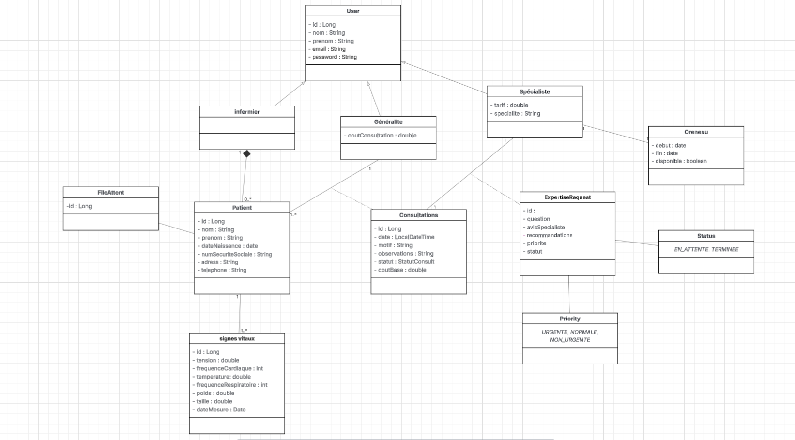

# 🏥 MediExpert

**MediExpert** est une application web de télé-expertise médicale développée en **Java EE (Servlets & JSP)**.  
Elle permet la gestion complète du parcours patient : enregistrement, file d'attente, consultations, ajout d'actes médicaux et demandes d'expertise vers des spécialistes.

---

## ⚙️ Technologies utilisées

- **Java 17**
- **Jakarta EE** (Servlets, JSP, JSTL)
- **Hibernate ORM**
- **PostgreSQL**
- **Apache Tomcat 10+**
- **Maven**
- **Tailwind CSS** + **Flatpickr**
- **BCrypt** (hachage des mots de passe)

---

## 📁 Structure du projet
```
MediExpert/
├── pom.xml
├── src/
│   ├── main/
│   │   ├── java/com/teleexpertise/
│   │   │   ├── config/          # Configuration (DB, Hibernate)
│   │   │   ├── model/           # Entités JPA
│   │   │   ├── dao/             # Accès aux données
│   │   │   ├── service/         # Logique métier
│   │   │   ├── servlet/         # Contrôleurs (Servlets)
│   │   │   ├── enums/           # Énumérations
│   │   │   └── util/            # Utilitaires
│   │   ├── resources/
│   │   │   └── hibernate.cfg.xml
│   │   └── webapp/
│   │       ├── WEB-INF/
│   │       │   ├── web.xml
│   │       │   └── views/       # Pages JSP
│   │       └── static/          # CSS, JS
│   └── test/                    # Tests unitaires
└── README.md
```

---

## 🧩 Fonctionnalités principales

### 👨‍⚕️ Module Médecin Généraliste
- Voir la liste des patients en attente
- Créer une consultation pour un patient
- Ajouter des actes médicaux à une consultation
- Envoyer une demande d'expertise à un spécialiste
- Suivre le statut des demandes

### 👨‍🔬 Module Médecin Spécialiste
- Consulter les demandes d'expertise reçues
- Filtrer par statut et priorité (Stream API)
- Donner un avis médical et des recommandations
- Gérer ses créneaux de disponibilité

### 👩‍⚕️ Module Infirmier
- Enregistrer un nouveau patient
- Mesurer et enregistrer les signes vitaux
- Ajouter les patients à la file d'attente

---

## 📊 Modèle de données

### Entités principales

| Entité | Description | Relations principales |
|--------|-------------|----------------------|
| **User** | Classe de base pour tous les utilisateurs | Héritage vers Infirmier, MedecinGeneraliste, MedecinSpecialiste |
| **Patient** | Informations du patient | `1-N` avec Consultation, SigneVital |
| **Consultation** | Consultation médicale | `N-1` avec Patient, MedecinGeneraliste<br>`1-1` avec ExpertiseRequest<br>`1-N` avec ActeMedical |
| **ActeMedical** | Acte technique (IRM, radiographie, etc.) | `N-1` avec Consultation |
| **ExpertiseRequest** | Demande d'avis spécialisé | `1-1` avec Consultation<br>`N-1` avec MedecinSpecialiste, Creneau |
| **Creneau** | Créneau horaire d'un spécialiste | `N-1` avec MedecinSpecialiste |
| **SigneVital** | Mesures vitales d'un patient | `N-1` avec Patient |

### Schéma des relations
```

```

---

## 🔄 Flux fonctionnel typique

### Scénario : Demande d'expertise

1. **Enregistrement du patient** (Infirmier)
    - Saisie des données administratives
    - Mesure des signes vitaux
    - Ajout à la file d'attente

2. **Consultation** (Médecin Généraliste)
    - Sélection du patient
    - Création de la consultation
    - Ajout d'actes médicaux si nécessaire
    - Saisie du diagnostic et observations

3. **Demande d'expertise** (si nécessaire)
    - Choix d'une spécialité
    - Filtrage des spécialistes disponibles (Stream API)
    - Sélection d'un créneau horaire
    - Rédaction de la question
    - Envoi de la demande (statut: `EN_ATTENTE`)

4. **Réponse du spécialiste**
    - Consultation de la demande
    - Rédaction de l'avis médical
    - Ajout de recommandations
    - Changement du statut à `TERMINEE`

---

## 🧠 Points techniques clés

### Gestion des créneaux
- Vérification automatique des chevauchements
- Création dynamique de créneaux si inexistants
- Marquage automatique comme indisponible lors de la réservation
- Filtrage des créneaux passés

### Utilisation des Stream API
Le système utilise l'API Stream Java pour :
- Filtrer les spécialistes par spécialité et tarif
- Filtrer les demandes d'expertise par statut et priorité
- Calculer les coûts totaux avec `map().sum()`

### Sécurité
- Authentification stateful par sessions
- Hachage des mots de passe avec BCrypt
- Protection CSRF sur les formulaires

### Validation métier
- Vérification qu'une consultation n'a pas déjà une demande en cours
- Contrôle des permissions selon le rôle utilisateur
- Validation des créneaux horaires (8h-12h)

---

## 🧪 Tests

Le projet inclut des tests unitaires avec **JUnit 5** et **Mockito** pour :
- Les services (logique métier)
- Les DAO (accès aux données)
- Les validations de chevauchement de créneaux

---

## 📝 Enums utilisés
```java
// Rôles utilisateurs
public enum Role {
    INFIRMIER, GENERALISTE, SPECIALISTE
}

// Statuts de consultation
public enum StatutConsultation {
    EN_COURS, TERMINEE, EN_ATTENTE_AVIS_SPECIALISTE
}

// Statuts de demande d'expertise
public enum StatutExpertise {
    EN_ATTENTE, TERMINEE
}

// Priorités
public enum PrioriteExpertise {
    URGENTE, NORMALE, NON_URGENTE
}
```

---

## 👨‍💻 Auteur

**MediExpert** — Projet développé en 2025

---

## 📝 Licence

Projet sous licence MIT — libre pour usage et modification.